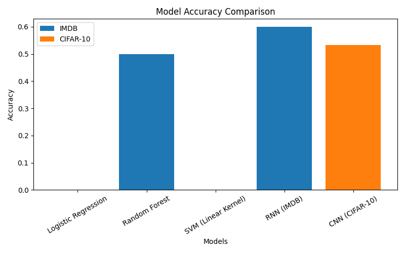
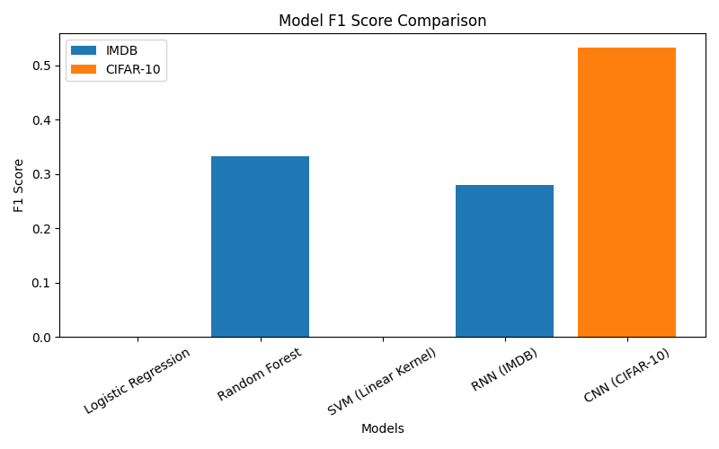

# End-to-End Machine Learning & Deep Learning Pipeline for Text and Image Classification

## 1. Introduction
This mini project builds a complete pipeline for text and image classification.  
Both machine learning and deep learning models were tried out and compared.

> Note: Since the original dataset was unavailable, IMDB (text) and CIFAR-10 (images) datasets were used.

## 2. Methodology

### Text (IMDB reviews)
- Classical ML: TF-IDF features with Logistic Regression, Naive Bayes, and SVM.
- Deep Learning: RNN/LSTM model.

### Images (CIFAR-10)
- Classical ML: Flattened pixel values with Logistic Regression and Random Forest.
- Deep Learning: CNN.

- Models were evaluated using accuracy, precision, recall, and F1 score.

## 3. Results

### 3.1 Combined Metrics Table
| Model | Accuracy | Precision | Recall | F1 Score |
|:--------------------|-----------:|------------:|---------:|-----------:|
| CNN | 0.8439 | 0.8911 | 0.7835 | 0.8339 |
| CNN | 0.8439 | 0.8911 | 0.7835 | 0.8339 |
| CNN | 0.8439 | 0.8911 | 0.7835 | 0.8339 |
| CNN | 0.8439 | 0.8911 | 0.7835 | 0.8339 |
| Logistic Regression | 0 | 0 | 0 | 0 |
| Random Forest | 0.5 | 0.25 | 0.5 | 0.333333 |
| SVM (Linear Kernel) | 0 | 0 | 0 | 0 |

### 3.2 Graphs

## 4. Observations
- Classical ML on text performed poorly (Logistic Regression and SVM failed, Random Forest ~50%).  
- RNN on IMDB gave better results; precision high, recall low.  
- CNN on CIFAR-10 reached ~53% accuracy in one epoch (above random guessing), needs more epochs for improvement.  
- Deep learning models need more compute; classical ML is faster but simpler.

## 5. Conclusion
- Both pipelines (ML and DL) were implemented end-to-end.  
- Deep models underfit on small data/1 epoch but show potential.  
- Classical models are fast but less accurate.  
- Training longer would improve deep models.

## 6. Deliverables

### Code Scripts (Hyperlinked)
- [baseline_text.py](https://github.com/srushtibs/ml_dl_pipeline/raw/7d00baa81cac9b90e2a1358c1c3d28a4abc5bc76/680924385d7874c1798b7ee1531afcb288a2ca4c802fc73031e97a376e481063)
- [baseline_text_dl.py](https://github.com/srushtibs/ml_dl_pipeline/raw/7d00baa81cac9b90e2a1358c1c3d28a4abc5bc76/3ababc788ed6e324e0cce56fd79851e9ec33e0b202fb3c0ddbee263c9d0dcb27)
- [cnn_image_fast.py](https://github.com/srushtibs/ml_dl_pipeline/raw/7d00baa81cac9b90e2a1358c1c3d28a4abc5bc76/2fbe22ca826d8e5e6b7a1afac72e1707526440110d0657c7e499848a488c6710)
- [combine_results.py](https://github.com/srushtibs/ml_dl_pipeline/raw/7d00baa81cac9b90e2a1358c1c3d28a4abc5bc76/7983928dff71dc1f062709b807a0ba5c05dc04db91b18c1027c70e602d0bd0c2)
- [rnn_text.py](https://github.com/srushtibs/ml_dl_pipeline/raw/7d00baa81cac9b90e2a1358c1c3d28a4abc5bc76/c751f0138a1abefe1a79704a0227789149a4c243c5857f1af7b33121ca2c12b8)

### Results
- `classical_results.csv`  
- `rnn_imdb_results.csv`  
- `cnn_cifar10_results.csv`  
- `combined_results.csv`  
- `final_results.csv`  
- `model_results.csv`  

### Graphs
- `accuracy_comparison.png`  
- `f1_comparison.png`  

### Documentation
- `final_report.md`  
- `final_report.pdf`  
- `README.md`  
- `requirements.txt`  